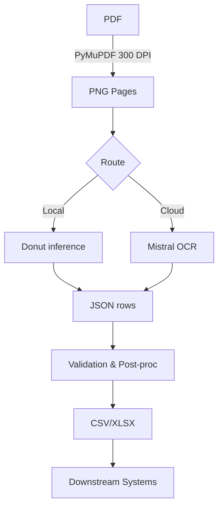

# PRD – Bank-Statement Extraction System

Date: July 3, 2025

---

## 1. Purpose
Build an end-to-end **Bank-Statement Extraction System** that ingests raw PDF statements (real or scanned) or JPGs or PNGs, outputs high-fidelity **CSV/XLSX transaction tables**, and exposes a clean SDK/CLI for downstream use.  
Fine-tuning Donut & Mistral OCR models is a **core but not sole** component of this initiative – additional workstreams include data curation, validation, post-processing, orchestration, and deployment.

## 2. Background
The current repo contains wrappers for Donut and Mistral that can run **zero-shot** inference (§ 4).  Accuracy on complex layouts – multi-line descriptions, bilingual headers, rotated scans – is inadequate.  Previous hand-crafted parsers were brittle; a domain-adapted LLM solves both OCR and layout understanding in one shot.

## 3. Goals & Success Metrics
* **Recall ≥ 98 %** on `date`, `description`, `amount`, `balance` fields across the validation set.
* **Exact-row F1 ≥ 95 %** when comparing generated CSV to ground truth.
* **Latency ≤ 4 s** per PDF page on M2 Pro CPU for Donut; ≤ 2 s via Mistral API.
* **Cost <$0.001** per page inference (Mistral variable; negotiable).

## 4. Scope
### In Scope
1. **Data pipeline** – PDF ingestion, 300 DPI rendering, secure storage, versioning.
2. **Schema design** – canonical JSON & CSV/XLSX spec for all downstream consumers.
3. **Model fine-tuning** – Donut (LoRA) & Mistral OCR managed jobs.
4. **Inference orchestration** – routing, batching, confidence scoring, fallback logic.
5. **Validation & post-processing** – numeric casting, duplicate detection, business-rule checks.
6. **Export & SDK** – CLI + Python API, support for CSV, XLSX, and JSONL.
7. **Evaluation harness** – pytest metrics, visual diff dashboard, CI integration.

### Out of Scope
* Mobile/Edge deployment.
* Full-blown web UI (simple CLI is sufficient for v1).
* Multilingual statements beyond English/Arabic.

## 5. User Stories
| As a… | I want… | So that… |
|-------|---------|----------|
| **Finance Analyst** | drag-and-drop a PDF and receive a tidy CSV | I can reconcile transactions in Excel. |
| **Backend Engineer** | a single `extract_transactions(pdf_path)` API call | integration into ETL jobs is trivial. |
| **ML Ops** | versioned, reproducible training runs | model updates don't break prod.

## 6. Assumptions & Dependencies
* Rye-managed Python env (torch >=2.4, transformers >=4.45).
* GPU access (A10G/A100) or Apple-silicon w/ MPS for Donut.
* Valid **MISTRAL_API_KEY** with fine-tune quota.
* Label Studio for any new manual annotations.

## 7. Data Requirements
| Source | Qty (pages) | Status |
|--------|-------------|--------|
| `data/For_Training/BS_PDFs` | ~2 000 | ✅ Real PDFs |
| `data/For_Training/BS_CSV` | Ground-truth CSV | ✅ |
| Synthetic generator | 10 k (on-demand) | ⚠ Multi-page WIP |
| Manual edge-cases (rotated, low-rez) | 200 | ❌ To collect |

All pages must be rendered at **300 DPI PNG** and linked to a JSON row list matching:
```json
{
  "transactions": [
    {"date":"01 Jan 2025","description":"Salary","amount":10000,"balance":12000}
  ]
}
```

## 8. Model Approach
### 8.1 Donut
* Base: `naver-clova-ix/donut-base` (encoder frozen).
* LoRA rank = 8 on decoder; prompt token added to tokenizer.
* Loss: cross-entropy; early-stop on val CER.

### 8.2 Mistral OCR
* Schema-based JSON output (same as § 7).
* Managed fine-tune: 3 epochs, learning-rate 1e-4.

### 8.3 Ensemble / Fallback
If Donut confidence < 0.9 use Mistral prediction; else Donut (local, cheaper).

## 9. Pipeline Architecture


Training orchestrated via **Makefile + typer CLI**; experiments tracked in `mlruns/` (MLflow).

## 10. Timeline (optimistic)
| Week | Milestone |
|------|-----------|
| **W27** | Dataset cleaning + JSON conversion script |
| **W28** | Donut fine-tune v0.1 ; baseline eval |
| **W29** | Mistral fine-tune v0.1 ; compare |
| **W30** | Multi-page synthetic + augmentation |
| **W31** | Ensemble logic + CLI/SDK freeze |
| **W32** | Documentation, test-coverage ≥ 90 %, CI pipeline |

## 11. Risks & Mitigations
* **Layout drift** – new bank templates ⇒ continuous fine-tune schedule.
* **API cost spike** – cache Mistral responses; local Donut first.
* **Data privacy** – enable `x-mistral-no-retention` for sensitive docs.

## 12. Open Questions
1. Acceptable export decimals (2 vs 3)?
2. Balance column sometimes absent – fill `NaN` or derive?  
3. Do we version control fine-tune datasets inside git-LFS?

---
_© extraction-ai project – PRD authored 2025-07-03_ 